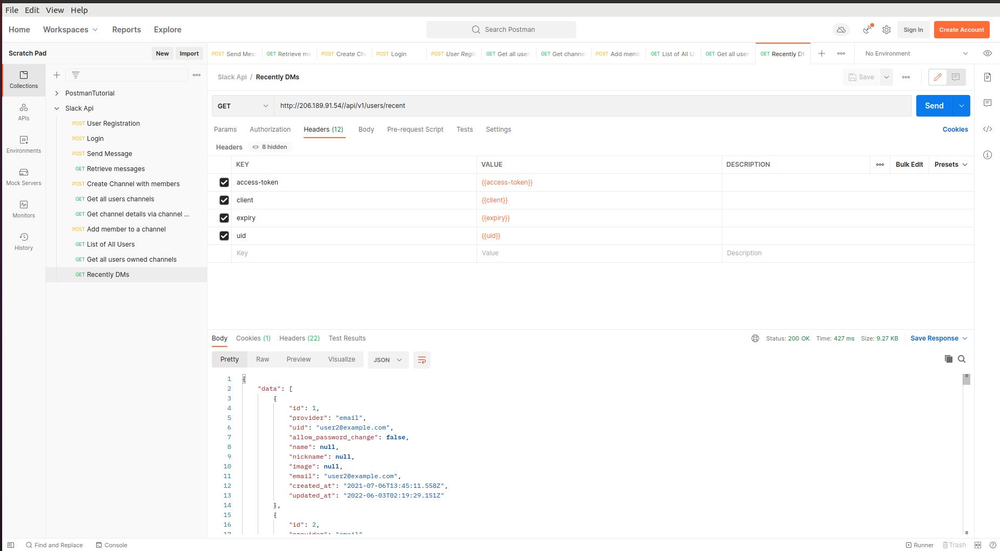
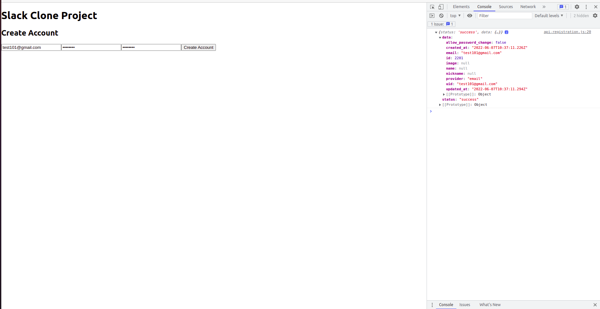

# Slack Clone

Final project for frontend.

## Tools

1. create-react-app app-name
2. npm
3. postman
4. api

## Documentation

1. Testing api using postman. Learn headers and create variables.

2. User Registration API. Create user with params: email, password, password_confirmation

